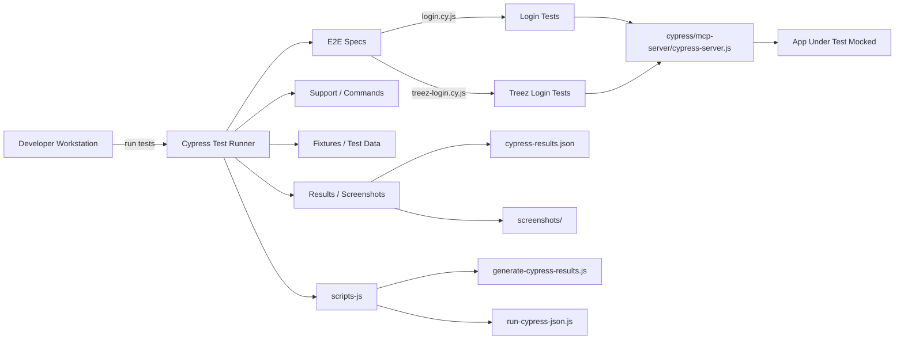

# Cypress MCP Demo

## Overview

This repository contains a Cypress end-to-end test demo for an MCP (mock/control) server used in the demo project. It includes Cypress test specs, fixtures, helper scripts, and a small `mcp-server` used for local test interactions.

## Architecture Diagram



## File Structure

- `cypress/` — Cypress test folders, fixtures, support and server
  - `e2e/` — test specs (`login.cy.js`, `treez-login.cy.js`)
  - `fixtures/` — sample data and manual-testing artifacts
  - `mcp-server/` — local node server `cypress-server.js` used by tests
  - `results/`, `screenshots/` — outputs from test runs
- `scripts/` — helper scripts to run tests and generate result artifacts
- `cypress.config.js` — Cypress configuration
- `package.json` — project dependencies and npm scripts

## Prerequisites

- Node.js 18+ (recommend latest LTS)
- npm or yarn
- (Optional) Chrome or Chromium for running Cypress GUI

## Installation

```bash
npm install
```

## Running Tests

- Run Cypress open (interactive):

```bash
npx cypress open
```

- Run headless tests (recommended for CI):

```bash
npx cypress run
```

- The project includes convenience scripts; see `package.json` for exact entries. Example:

```bash
npm run test:headless
```

## Local MCP Server

To run the local MCP server used by tests:

```bash
node cypress/mcp-server/cypress-server.js
```

Run it before executing tests if tests depend on the mocked endpoints.

## Scripts

- `scripts/generate-cypress-results.js` — post-processes `cypress-results.json` into reports (HTML/other formats).
- `scripts/run-cypress-json.js` — helper to run Cypress and emit `cypress-results.json` for CI consumption.
- `scripts/inspect-login-page.js` / `inspect-login-page.py` — utilities for inspecting the login page DOM or taking metadata snapshots.

## Test Results & Reporting

- After running, results are written to `cypress/results/cypress-results.json`.
- Screenshots are saved to `cypress/screenshots/`.
- Manual test artifacts live under `cypress/fixtures/manual-testing/`.
- Use `node scripts/generate-cypress-results.js` to generate `cypress-results.html` or other summary views.

## How to Add New Tests

1. Add a new spec file to `cypress/e2e/` with a `.cy.js` extension.
2. Use fixtures from `cypress/fixtures/` for test data.
3. Add helper commands to `cypress/support/commands.js` if needed.

## Contributing

- Open issues or PRs with reproducible steps.
- Follow the existing structure for test files and support utilities.

## Next Steps

- Run the MCP server locally and execute `npx cypress run` to validate everything.
- Optionally integrate with CI (GitHub Actions) to run headless tests on commits.

## License

MIT

Repo created : Arun M
Email @ mkarun1122@gmail.com
